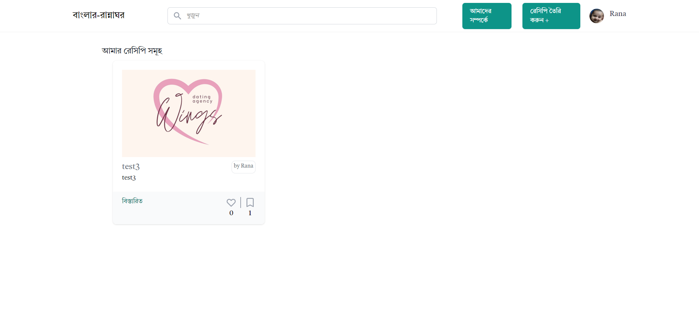
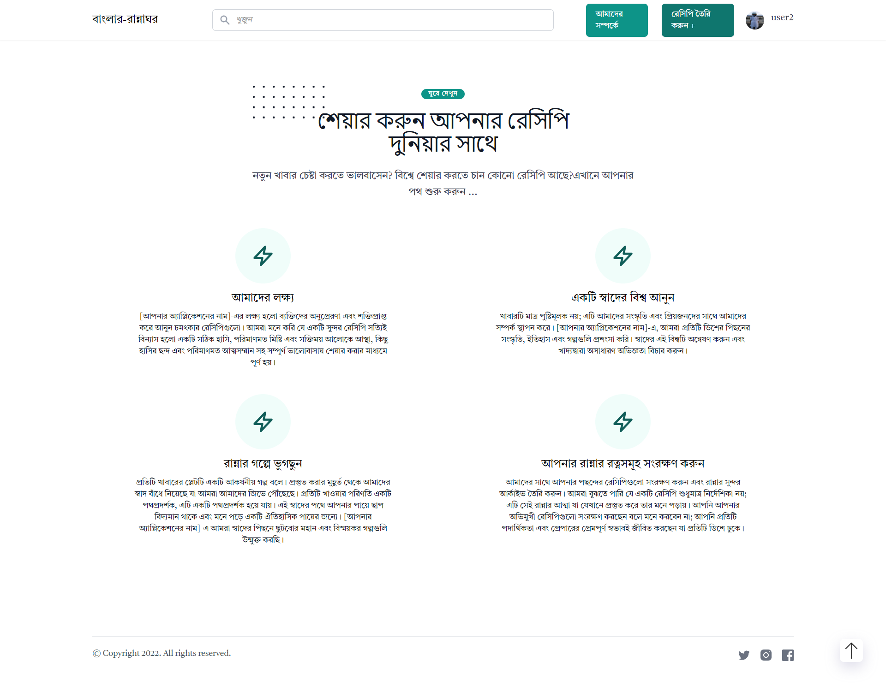
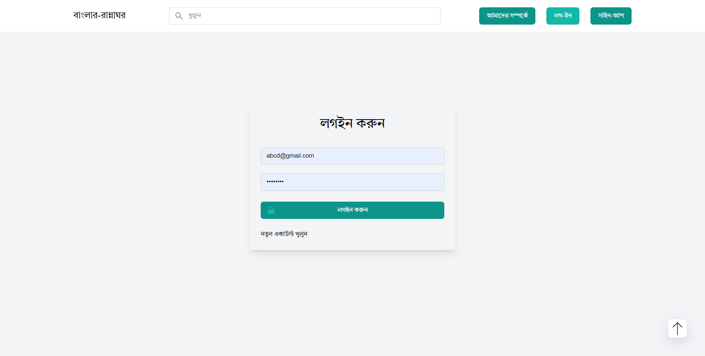
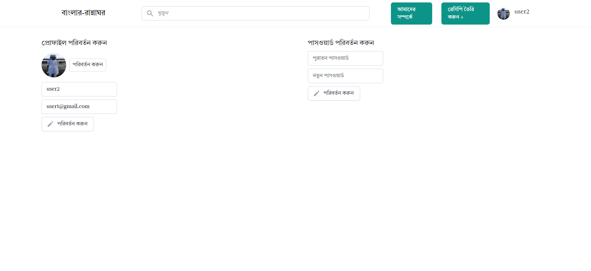
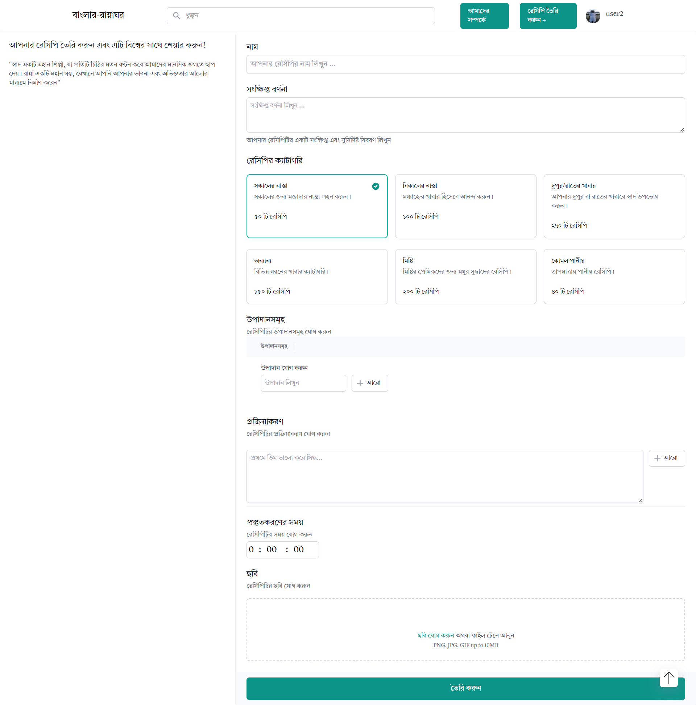
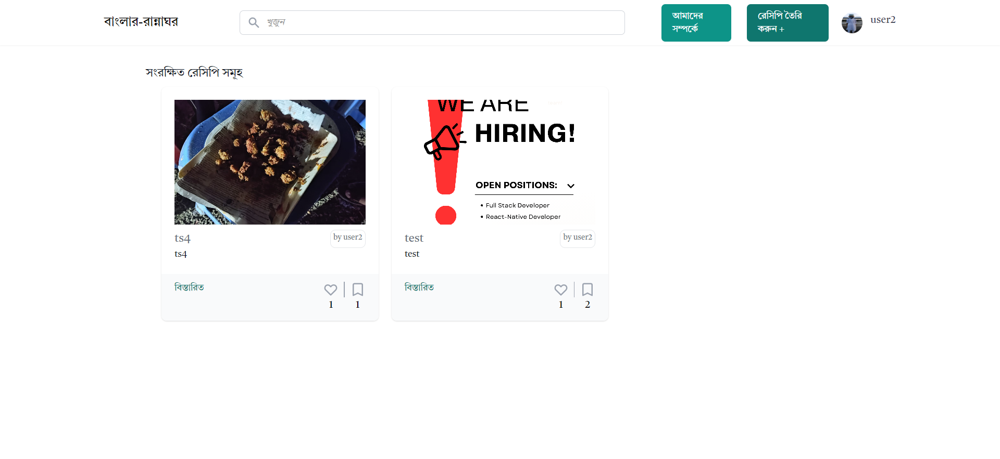
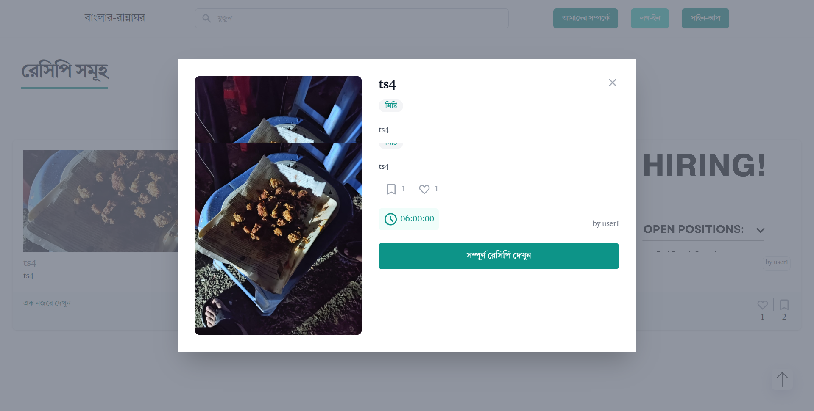

# Bangla Ranna Ghor Web Application
Bangla Ranna Ghor is a full-stack web application built using the Django backend, MySQL database, Cloudinary for image storage, and React frontend. The application allows users to register, log in, update their profile, upload their picture, create recipes, bookmark recipes, and like recipes.

<div align="center" >
      
      


</div>

# Features

## User Authentication
Users can register with their email and password to create an account. Upon successful registration, they can log in with their credentials.
Here are some screenshots:
<div align="center" >
      

</div>

## User Profile
Registered users can update their profile information, including their name, email, and other details. They can also upload a profile picture using Cloudinary for image storage.

<div  align="center">
            


</div>


## Recipe Creation

Authenticated users can create new recipes by providing a title, description, ingredients, and step-by-step instructions. They can also upload an image for the recipe using Cloudinary.

<div align="center">
    

</div>


## Recipe Bookmarking

Users can bookmark their favorite recipes, allowing them to quickly access them from their dashboard.
<div align="center">
    
</div>

## Recipe Likes
Users can like recipes to show their appreciation for the recipes they find interesting.
<div align="center">
    
  
</div>

## Toast Notifications

The application includes toast notifications to provide feedback to users after various events, such as successful registration, login, or updating the profile.

# Technologies Used
## Backend
Django
MySQL database
## Frontend
React.js
Axios for data fetching
Cloudinary for image storage

`[https://bookdoctoronline.herokuapp.com/ ] Please note that the Heroku deployment has a time limit, which may result in the temporary unavailability of the application.`

# Prerequisites
Before running the Bangla Ranna Ghor web application, ensure that you have the following prerequisites installed:

Node.js (version 12 or above)
Python (version 3.x)
MySQL database
Package Manager (npm or yarn)

# Installation and Setup

Clone the repository or download the source code.
Navigate to the project directory in your terminal.
Install the required backend dependencies by running the following command:
```
pip install -r requirements.txt
```
Configure the backend database settings in the Django settings.py file to connect to your MySQL database.
Apply migrations to create the necessary database tables:

``
python manage.py migrate
``
Start the Django development server:
```
python manage.py runserver
```

Install the frontend dependencies by running the following command:
```
npm install
```
Start the frontend development server by running the following command:
```
npm start
```
Access the application by opening your browser and visiting http://localhost:3000.

# Contributions

Contributions to the Bangla Ranna Ghor web application are welcome. If you encounter any issues or have suggestions for improvements, please open an issue on the project's GitHub repository.

# License
The Bangla Ranna Ghor web application is released under the MIT License.
# Acknowledgments
The development of the Bangla Ranna Ghor web application was made possible thanks to the contributions and support of the open-source community.
